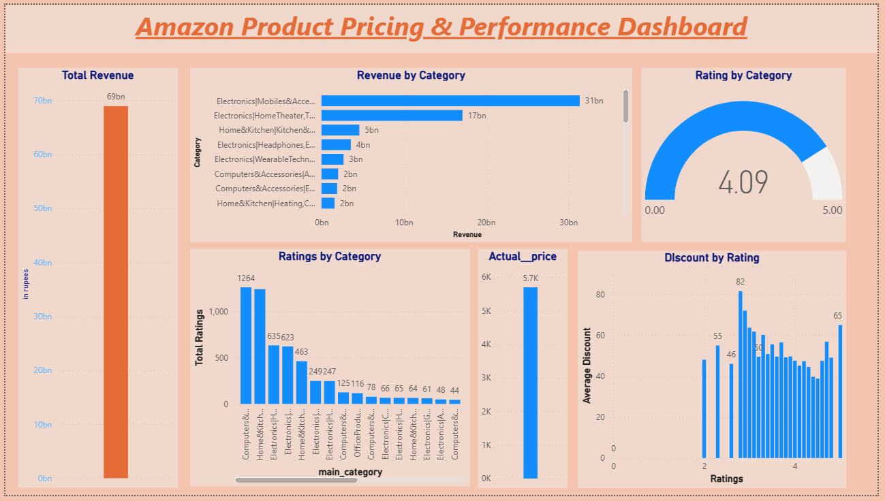
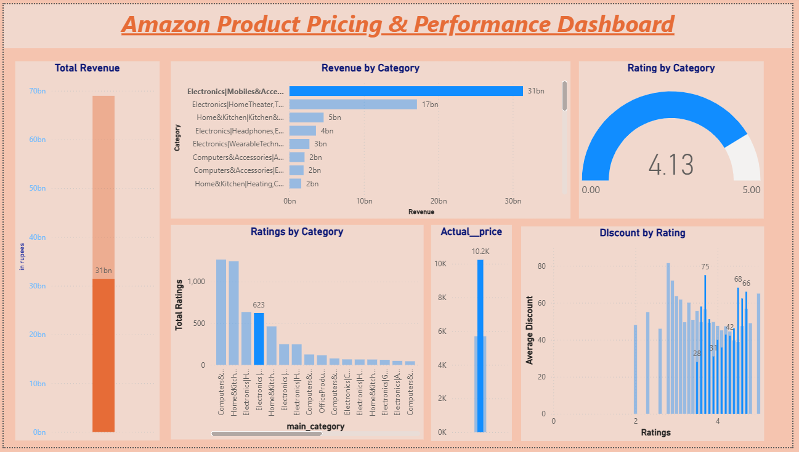
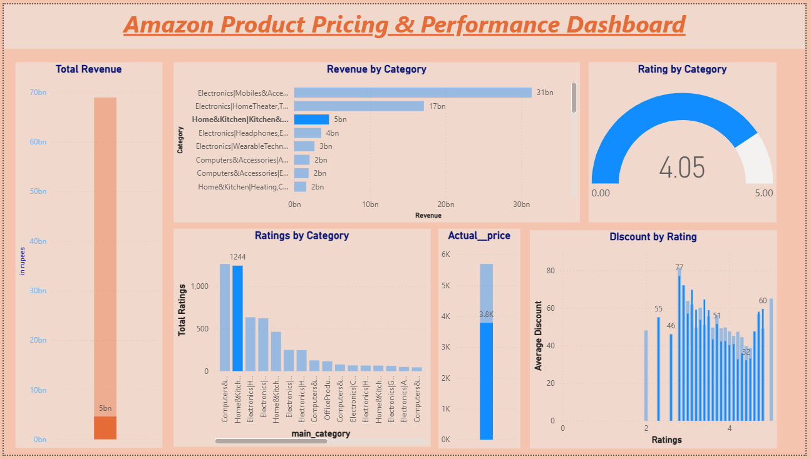
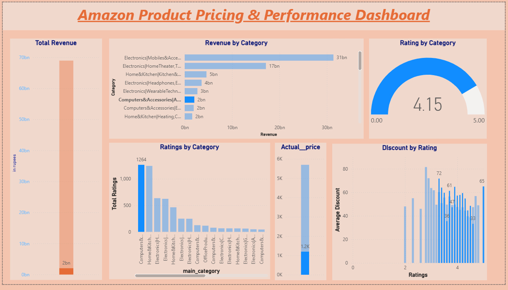
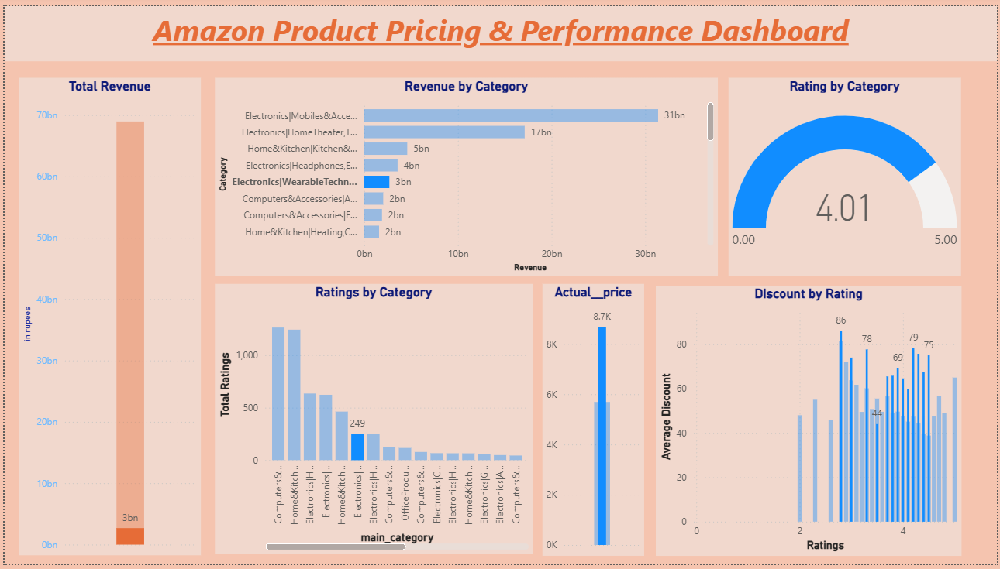

#  Amazon Product Pricing & Performance Analysis

##  Project Overview

This project analyzes Amazon product data to understand how pricing, discounts, and customer feedback impact product performance.

The goal was to derive actionable business insights that can help improve revenue, customer satisfaction, and product strategy.

##  Tools & Technologies

- Excel (Data Cleaning & Preprocessing)
- PostgreSQL (Data Storage & SQL Analysis)
- Power BI (Dashboard & Visualization)
- Python, Pandas (connection between tools)

##  Data Cleaning & Preparation

- Removed duplicate records and handled missing values using Excel
- Fixed Data types (e.g., rating, rating_count, discount_percentage)
- Removed and trimmed inputs for special characters (e.g., % in discount_percentage, ₹ in Discount_Price and Actual_Price column)
- Standardized inconsistent category names using SQL (e.g., subcategories in electronics categories)
- Created new columns:
  - Revenue (proxy) = discounted_price × rating_count
  - Profit (assumed margin-based calculation)
- Structured data in PostgreSQL for further analysis and visualization

## SQL Queries

SQL was used to perform category-level aggregation and extract insights.
- Top 5 Most Profitable Products
- The 5 Highest Rated Categories
- The Biggest Discounts Configured
- Add main_category column to products table
- Total Revenue By category Products
- Average Rating By category Products

(see 'sql_queries.py' for full queries)

## Key Insights

- The Electronics category generates the highest revenue but has a relatively low rating count, indicating a need to improve customer engagement and feedback collection.

- Home & Kitchen appliances have the highest rating count but low average ratings and low revenue contribution, even with heavy discounts. This suggests quality issues that negatively impact customer satisfaction.

- The Computers & Accessories category has a strong average rating (~4.2) but contributes low revenue, indicating potential to increase revenue by optimizing pricing and reducing excessive discounts.

- Products in the Computers & Accessories category are generally low-priced, suggesting an opportunity to introduce higher-margin products to improve profitability.

- Wearable Electronics show low revenue and low rating count despite heavy discounts. High product pricing appears to be a barrier, indicating a need to introduce more affordable options to drive sales.

##  Business Recommendations

- Improve customer feedback mechanisms in high-revenue categories like Electronics to enhance product trust and engagement.

- Focus on improving product quality in Home & Kitchen appliances to convert high engagement into higher revenue.

- Optimize pricing strategies in Computers & Accessories by reducing unnecessary discounts and introducing premium product lines.

- Expand product range in Wearable Electronics by including lower-priced alternatives to increase accessibility and sales volume.

## 📈 Dashboard

An interactive Power BI dashboard was created to visualize:

- Revenue distribution across categories  
- Customer ratings and engagement  
- Pricing and discount impact  


### Dashboard Preview:






## Conclusion

This project demonstrates how data-driven analysis can help businesses optimize pricing strategies, improve product quality, and enhance customer satisfaction.

The insights derived can support better decision-making in product positioning and revenue growth.

## How to Run

1. **Install Dependencies**: Make sure you have Python installed. Then, install the required packages using pip:
   ```bash
   pip install pandas psycopg2
   ```
2. **Database Setup**: Set up your PostgreSQL database and update credentials in the scripts as necessary.
3. **Execute Scripts**:
   - Run `create_db.py` to set up the database schema: `python create_db.py`
   - Run `sales_db.py` to extract, clean, and load the data to the database: `python sales_db.py`
   - Run `sql_queries.py` to perform the analysis: `python sql_queries.py`

## Project Structure

```text
├── README.md
├── create_db.py      # Database connection and schema setup
├── sales_db.py       # Data cleaning and loading into PostgreSQL
├── sql_queries.py    # SQL analytical queries
├── amazon.csv        # Raw dataset
├── image.png         # Main dashboard screenshot
└── image-*.png       # Category specific dashboard screenshots
```

## Data Source

The data used in this project is sourced from the dataset containing product information, pricing, ratings, and categories from Kaggle (`amazon.csv`).
